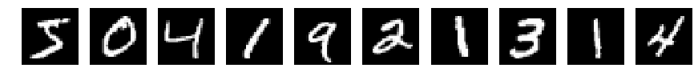
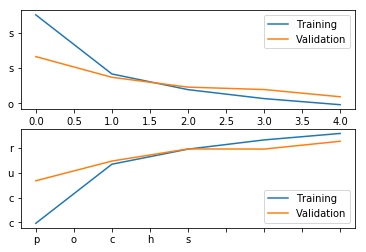
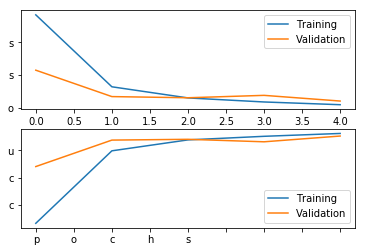

# Convolution Neural Network

## 1. 데이터 불러오기

~~~python
>>> import numpy as np

>>> X_train = np.load('x_train.npy')
>>> Y_train = np.load('y_train.npy')
>>> X_test = np.load('x_test.npy')
>>> Y_test = np.load('y_test.npy')

>>> print(X_train.shape)

(60000, 28, 28)

>>> print(Y_train.shape)

(60000,)

>>> print(X_test.shape)

(10000, 28, 28)

>>> print(Y_test.shape)

(10000,)  
~~~

X_train은 3차원의 데이터로  
60000은 표본의 개수이고 28, 28은 각각 데이터 한 개의 가로, 세로의 픽셀수를 나타냅니다.

~~~python
>>> X_train[1, :, :]

array([[ 0,  0,  0,  0,  0,  0,  0,  0,  0,  0,  0,  0,  0,  0,  0,  0,  0,  0,  0,  0,  0,  0,  0,  0,  0,  0,  0,  0],
       [ 0,  0,  0,  0,  0,  0,  0,  0,  0,  0,  0,  0,  0,  0,  0,  0,  0,  0,  0,  0,  0,  0,  0,  0,  0,  0,  0,  0],
       [ 0,  0,  0,  0,  0,  0,  0,  0,  0,  0,  0,  0,  0,  0,  0,  0,  0,  0,  0,  0,  0,  0,  0,  0,  0,  0,  0,  0],
       [ 0,  0,  0,  0,  0,  0,  0,  0,  0,  0,  0,  0,  0,  0,  0,  0,  0,  0,  0,  0,  0,  0,  0,  0,  0,  0,  0,  0],
       [ 0,  0,  0,  0,  0,  0,  0,  0,  0,  0,  0,  0,  0,  0,  0,  0,  0,  0,  0,  0,  0,  0,  0,  0,  0,  0,  0,  0],
       [ 0,  0,  0,  0,  0,  0,  0,  0,  0,  0,  0,  0,  3, 18, 18, 18,126,136,175, 26,166,255,247,127,  0,  0,  0,  0],
       [ 0,  0,  0,  0,  0,  0,  0,  0, 30, 36, 94,154,170,253,253,253,253,253,225,172,253,242,195, 64,  0,  0,  0,  0],
       [ 0,  0,  0,  0,  0,  0,  0, 49,238,253,253,253,253,253,253,253,253,251, 93, 82, 82, 56, 39,  0,  0,  0,  0,  0],
       [ 0,  0,  0,  0,  0,  0,  0, 18,219,253,253,253,253,253,198,182,247,241,  0,  0,  0,  0,  0,  0,  0,  0,  0,  0],
       [ 0,  0,  0,  0,  0,  0,  0,  0, 80,156,107,253,253,205, 11,  0, 43,154,  0,  0,  0,  0,  0,  0,  0,  0,  0,  0],
       [ 0,  0,  0,  0,  0,  0,  0,  0,  0, 14,  1,154,253, 90,  0,  0,  0,  0,  0,  0,  0,  0,  0,  0,  0,  0,  0,  0],
       [ 0,  0,  0,  0,  0,  0,  0,  0,  0,  0,  0,139,253,190,  2,  0,  0,  0,  0,  0,  0,  0,  0,  0,  0,  0,  0,  0],
       [ 0,  0,  0,  0,  0,  0,  0,  0,  0,  0,  0, 11,190,253, 70,  0,  0,  0,  0,  0,  0,  0,  0,  0,  0,  0,  0,  0],
       [ 0,  0,  0,  0,  0,  0,  0,  0,  0,  0,  0,  0, 35,241,225,160,108,  1,  0,  0,  0,  0,  0,  0,  0,  0,  0,  0],
       [ 0,  0,  0,  0,  0,  0,  0,  0,  0,  0,  0,  0,  0, 81,240,253,253,119, 25,  0,  0,  0,  0,  0,  0,  0,  0,  0],
       [ 0,  0,  0,  0,  0,  0,  0,  0,  0,  0,  0,  0,  0,  0, 45,186,253,253,150, 27,  0,  0,  0,  0,  0,  0,  0,  0],
       [ 0,  0,  0,  0,  0,  0,  0,  0,  0,  0,  0,  0,  0,  0,  0, 16, 93,252,253,187,  0,  0,  0,  0,  0,  0,  0,  0],
       [ 0,  0,  0,  0,  0,  0,  0,  0,  0,  0,  0,  0,  0,  0,  0,  0,  0,249,253,249, 64,  0,  0,  0,  0,  0,  0,  0],
       [ 0,  0,  0,  0,  0,  0,  0,  0,  0,  0,  0,  0,  0,  0, 46,130,183,253,253,207,  2,  0,  0,  0,  0,  0,  0,  0],
       [ 0,  0,  0,  0,  0,  0,  0,  0,  0,  0,  0,  0, 39,148,229,253,253,253,250,182,  0,  0,  0,  0,  0,  0,  0,  0],
       [ 0,  0,  0,  0,  0,  0,  0,  0,  0,  0, 24,114,221,253,253,253,253,201, 78,  0,  0,  0,  0,  0,  0,  0,  0,  0],
       [ 0,  0,  0,  0,  0,  0,  0,  0, 23, 66,213,253,253,253,253,198, 81,  2,  0,  0,  0,  0,  0,  0,  0,  0,  0,  0],
       [ 0,  0,  0,  0,  0,  0, 18,171,219,253,253,253,253,195, 80,  9,  0,  0,  0,  0,  0,  0,  0,  0,  0,  0,  0,  0],
       [ 0,  0,  0,  0, 55,172,226,253,253,253,253,244,133, 11,  0,  0,  0,  0,  0,  0,  0,  0,  0,  0,  0,  0,  0,  0],
       [ 0,  0,  0,  0,136,253,253,253,212,135,132, 16,  0,  0,  0,  0,  0,  0,  0,  0,  0,  0,  0,  0,  0,  0,  0,  0],
       [ 0,  0,  0,  0,  0,  0,  0,  0,  0,  0,  0,  0,  0,  0,  0,  0,  0,  0,  0,  0,  0,  0,  0,  0,  0,  0,  0,  0],
       [ 0,  0,  0,  0,  0,  0,  0,  0,  0,  0,  0,  0,  0,  0,  0,  0,  0,  0,  0,  0,  0,  0,  0,  0,  0,  0,  0,  0],
       [ 0,  0,  0,  0,  0,  0,  0,  0,  0,  0,  0,  0,  0,  0,  0,  0,  0,  0,  0,  0,  0,  0,  0,  0,  0,  0,  0,  0]], 
      dtype=uint8)
~~~

각 이미지의 픽셀 한 개는 0부터 255사이의 값을 갖게 되는데 낮을수록 어두워지고 높을수록 밝은 색을 나타냅니다.  
처음 몇개만 이미지로 나타내보면 다음과 같습니다.

~~~python
>>> from PIL import Image
>>> import matplotlib.pyplot as plt

>>> fig, ax = plt.subplots(1, 10)
>>> for i in range(10):
...     im = Image.fromarray(X_train[i, :, :])
...     ax[i].axis('off')
...     ax[i].imshow(im)
~~~

~~~python
>>> Y_train[:10]

array([5, 0, 4, 1, 9, 2, 1, 3, 1, 4], dtype=uint8)
~~~

Y값에는 해당 이미지에 적힌 숫자값이 들어있습니다.

## 2. 학습

~~~python
>>> from sklearn.model_selection import train_test_split

>>> X_train, X_val, Y_train, Y_val = train_test_split(X_train, Y_train, train_size=42000)
~~~

train set을 다시 train set과 validation set으로 나눠줍니다.
train set은 말 그대로 학습시키는 데이터들이고, validation set은 학습시킨 모델의 정확도롤 평가하는데 사용할 데이터입니다.

~~~python
>>> from keras.utils import np_utils

>>> Y_train = np_utils.to_categorical(Y_train)
>>> Y_test = np_utils.to_categorical(Y_test)
~~~

또한 단순 1차원 벡터인 Y를 카테고리화시켜서 10차원의 벡터로 바꾸어줍니다.

### 2.1 일반적인 Neural Network를 사용하여 학습

~~~python
>>> X_train = X_train.reshape(60000, 28*28).astype('float32')/255.0
>>> X_test = X_test.reshape(10000, 28*28).astype('float32')/255.0

>>> X_train.shape

(42000, 784)

>>> X_train

array([[0., 0., 0., ..., 0., 0., 0.],
       [0., 0., 0., ..., 0., 0., 0.],
       [0., 0., 0., ..., 0., 0., 0.],
       ...,
       [0., 0., 0., ..., 0., 0., 0.],
       [0., 0., 0., ..., 0., 0., 0.],
       [0., 0., 0., ..., 0., 0., 0.]], dtype=float32)
~~~

위와 같이 정사각형 모양의 데이터를 일렬로 배열해줍니다.

~~~python
>>> import tensorflow
>>> from keras.models import Sequential
>>> from keras.layers import Dense
>>> from keras.optimizers import SGD

>>> in_dim = 28*28
>>> out_dim = 10

>>> model = Sequential()
>>> model.add(Dense(units = 64, input_dim=in_dim, activation='relu'))
>>> model.add(Dense(units = out_dim, activation='softmax'))

>>> model.summary()

Layer (type)                 Output Shape              Param #   
=================================================================
dense_7 (Dense)              (None, 64)                50240     
_________________________________________________________________
dense_8 (Dense)              (None, 10)                650       
=================================================================
Total params: 50,890
Trainable params: 50,890
Non-trainable params: 0
~~~

이렇게 일반적인 신경망을 통해 학습시키게 되면 겨우 (28 x 28) 크기의 이미지이지만 계산해야 할 parameter가 무려 5만개가 넘어간다.  
너무 비효율적이다.

~~~python
>>> sgd = SGD(lr=0.01, decay=1e-6, momentum=0.9, nesterov=True)

>>> model.compile(loss='categorical_crossentropy', optimizer=sgd, metrics=['accuracy'])

>>> hist = model.fit(X_train, Y_train, epochs=5, batch_size=32, verbose=1, validation_data=(X_val, Y_val))

Train on 42000 samples, validate on 18000 samples
Epoch 1/5
42000/42000 [==============================] - 4s 101us/step - loss: 0.3506 - acc: 0.8993 - val_loss: 0.2325 - val_acc: 0.9336
Epoch 2/5
42000/42000 [==============================] - 4s 91us/step - loss: 0.1834 - acc: 0.9469 - val_loss: 0.1740 - val_acc: 0.9494
Epoch 3/5
42000/42000 [==============================] - 4s 93us/step - loss: 0.1391 - acc: 0.9590 - val_loss: 0.1462 - val_acc: 0.9592
Epoch 4/5
42000/42000 [==============================] - 4s 89us/step - loss: 0.1138 - acc: 0.9665 - val_loss: 0.1394 - val_acc: 0.9591
Epoch 5/5
42000/42000 [==============================] - 4s 94us/step - loss: 0.0965 - acc: 0.9717 - val_loss: 0.1189 - val_acc: 0.9654
~~~

SGD를 이용해서 학습시켰고 epoch는 5번만 이용해 학습시켰다.

~~~python
>>> fig, ax = plt.subplots(2, 1)

>>> ax[0].set_yticklabels('Loss')
>>> ax[0].plot(hist.history['loss'])
>>> ax[0].plot(hist.history['val_loss'])
>>> ax[0].legend(['Training', 'Validation'])

>>> ax[1].set_xticklabels('Epochs')
>>> ax[1].set_yticklabels('Accuracy')
>>> ax[1].plot(hist.history['acc'])
>>> ax[1].plot(hist.history['val_acc'])
>>> ax[1].legend(['Training', 'Validation'])
~~~

~~~python
>>> loss_and_metrics = model.evaluate(X_test, Y_test, batch_size=32)
>>> print('loss_and_metrics : '+str(loss_and_metrics))

>>> loss_and_metrics = model.evaluate(X_test, Y_test, batch_size=32)
>>> print('Accuracy : '+str(accuracy))
>>> print('Loss : '+str(loss))

10000/10000 [==============================] - 0s 31us/step
Accuracy : 0.9684
Loss : 0.10613960536569357
~~~

### 2.2 CNN을 이용하여 학습

#### CNN의 구성 : 

1. Convolutional Layer : 이미지와 필터 사이의 연산 수행

	- filter(kernel) : 이미지 픽셀과 겹쳐서 계산할 parameter. (보통 정사각형 : 3x3 or 4x4)
	- stride : filter를 움직이며 계산할 (가로와 세로의) 간격
	- padding : 이미지의 가장자리를 0 혹은 특정 숫자로 채운다.

2. Pooling Layer : 연산량을 줄이기 위해 행렬의 크기를 감소

	- 특정 크기만큼 잘라 해당 구간의 Max or Min or Mean을 계산 (얘도 일반적으로 정사각형)

3. Fully-connected Layer : 위 두 과정을 반복한 후 output 출력

~~~python
>>> from keras import backend as K

>>> img_row = 28
>>> img_col = 28

>>> if K.image_data_format()=='channels_first':
...     shape_ord = (1, img_row, img_col)
... else:
...     shape_ord = (img_row, img_col, 1)

>>> shape_ord

(28, 28, 1)

>>> X_train = X_train.reshape((X_train.shape[0], )+shape_ord)
>>> X_val = X_val.reshape((X_val.shape[0], )+shape_ord)
>>> X_test = X_test.reshape((X_test.shape[0], )+shape_ord)
>>> X_train.shape

(42000, 28, 28, 1)
~~~

input 데이터의 형태를 다시 바꿔줍니다.  
28, 28은 가로와 세로의 픽셀 수이고, 1은 이미지의 차원의 크기를 말하는데 본 이미지는 흑백이므로 1의 값을 갖습니다.

~~~python
>>> from keras.layers.convolutional import Conv2D
>>> from keras.layers.pooling import MaxPooling2D
>>> from keras.layers import Flatten

>>> model = Sequential()
>>> model.add(Conv2D(filters=4, kernel_size=(3, 3), strides=(1, 1), padding='same', use_bias=True, input_shape=shape_ord, activation='relu'))
>>> model.add(MaxPooling2D(pool_size=(3, 3)))
>>> model.add(Flatten())
>>> model.add(Dense(units=out_dim, activation='softmax'))
>>> model.summary()

_________________________________________________________________
Layer (type)                 Output Shape              Param #   
=================================================================
conv2d_1 (Conv2D)            (None, 28, 28, 4)         104       
_________________________________________________________________
max_pooling2d_1 (MaxPooling2 (None, 9, 9, 4)           0         
_________________________________________________________________
flatten_1 (Flatten)          (None, 324)               0         
_________________________________________________________________
dense_3 (Dense)              (None, 10)                3250      
=================================================================
Total params: 3,354
Trainable params: 3,354
Non-trainable params: 0
_________________________________________________________________
~~~
                 
parameter의 개수가 현저하게 줄어든 것을 확인할 수 있습니다.

~~~python
>>> model.compile(loss='categorical_crossentropy', optimizer=sgd, metrics=['accuracy'])

>>> hist = model.fit(X_train, Y_train, epochs=5, batch_size=32, verbose=1, validation_data=(X_val, Y_val))

Train on 42000 samples, validate on 18000 samples
Epoch 1/5
42000/42000 [==============================] - 31s 748us/step - loss: 0.3845 - acc: 0.8832 - val_loss: 0.2152 - val_acc: 0.9352
Epoch 2/5
42000/42000 [==============================] - 32s 771us/step - loss: 0.1644 - acc: 0.9497 - val_loss: 0.1344 - val_acc: 0.9595
Epoch 3/5
42000/42000 [==============================] - 32s 759us/step - loss: 0.1303 - acc: 0.9597 - val_loss: 0.1308 - val_acc: 0.9602
Epoch 4/5
42000/42000 [==============================] - 32s 768us/step - loss: 0.1179 - acc: 0.9630 - val_loss: 0.1382 - val_acc: 0.9579
Epoch 5/5
42000/42000 [==============================] - 29s 687us/step - loss: 0.1096 - acc: 0.9656 - val_loss: 0.1207 - val_acc: 0.9632
~~~

역시 SGD를 이용해서 학습시켰고 epoch에 5를 적용시켰다.

~~~python
>>> fig, ax = plt.subplots(2, 1)

>>> ax[0].set_yticklabels('Loss')
>>> ax[0].plot(hist.history['loss'])
>>> ax[0].plot(hist.history['val_loss'])
>>> ax[0].legend(['Training', 'Validation'])

>>> ax[1].set_xticklabels('Epochs')
>>> ax[1].set_yticklabels('Accuracy')
>>> ax[1].plot(hist.history['acc'])
>>> ax[1].plot(hist.history['val_acc'])
>>> ax[1].legend(['Training', 'Validation'])
~~~

~~~python
>>> loss, accuracy = model.evaluate(X_test, Y_test, batch_size=32)
>>> print('Loss : '+str(loss))
>>> print('Accuracy : '+str(accuracy))

10000/10000 [==============================] - 4s 382us/step
Loss : 0.10707559986934066
Accuracy : 0.9657
~~~
